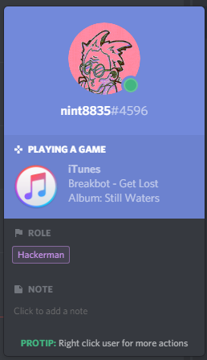
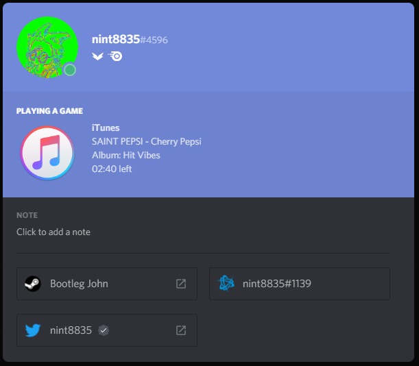

# Rich Presence for iTunes

## Usage
* Download latest release (iTunesRichPresence_64bit.zip) from [releases page](https://github.com/nint8835/iTunesRichPresence/releases)
* Extract the zip file
* Run iTunesRichPresence.exe
* Start listening to music

Your discord should now display your currently playing music from iTunes

## Building
* Build project
* Place a copy of discord-rpc.dll in the same folder as the executable. You can get a copy of this file from [here.](https://github.com/discordapp/discord-rpc/releases)

## Contact
If you would like to contact me, feel free to send me an email at riley@rileyflynn.me, or join [the Discord server](https://discord.gg/57a8dqb)

**Note: there are no plans for a Mac version of this software.**

## Credits
* DiscordRPC.cs is taken from [https://github.com/discordapp/discord-rpc/blob/master/examples/button-clicker/Assets/DiscordRpc.cs](https://github.com/discordapp/discord-rpc/blob/master/examples/button-clicker/Assets/DiscordRpc.cs)
* Minimizing to system tray was implemented by [MissingNO123](https://github.com/MissingNO123)
* Initial Unicode support and locale-independent playlist detection was implemented by [FukujiMihoko](https://github.com/FukujiMihoko)
